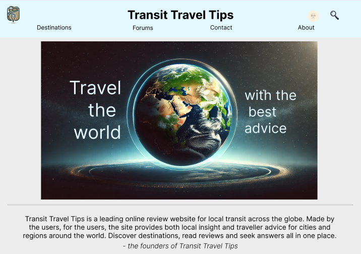
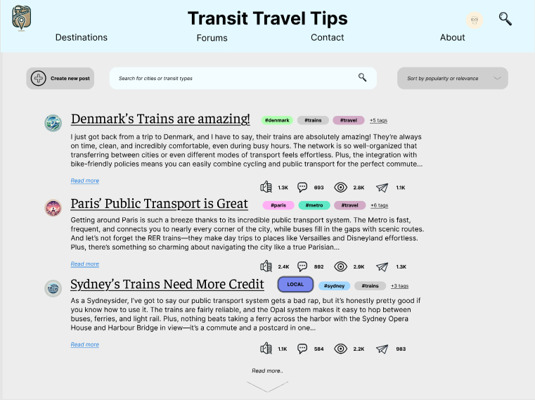
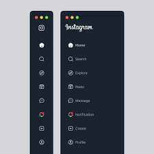
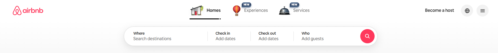
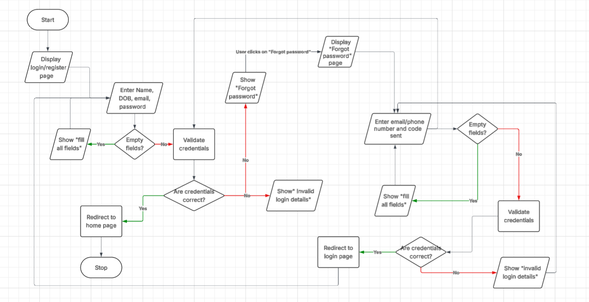

# transit travel tips

## website overview
Transit Travel Tips is a user-driven website designed to help travellers share and discover advice about all forms of transport, from buses to planes. The platform will feature a clean, easy-to-use interface with categorized forums, search tools, and user profiles. It aims to create a welcoming and informative community hub with multilingual support and secure, scalable infrastructure. The design will focus on clarity, accessibility, and smooth performance across devices.

| **functional requirements** | **non-functional requirements** |
| ----------- | ----------- |
| user registration and login | secure data storage using encryption |
| forum and post management | friendly UI |
| categorisation of posts| scalable backend for handling growth |6
| user account management |
| analytics and Feedback| 

### first wireframe

for my first wireframe, colour palattes and typography were not mainly focused on. the header placement and design layout were experimented with.

### theme
the overall theme of the website is social media apps such as instagram, especially the sidebar containing the home, messages, notifications and explore buttons. however, instead of the search bar being on the side, there will be a global search bar at the top of the website, similar to the one on airbnb.

### colour palette
the colour scheme of the website will be "minimal yet warm", having the colours:
- #EAE7DC light shade of yellow
- #D8C3A5 shade of cream
- #8E8D8A light grey
- #E98074 light red
- #E85A4F red

### typography
a clean, simple and neutral design, similar to helvetica and nimbus sans will be considered for the website.

### second wireframe

### login page flowchart

### test cases
**test tase id: tc01**

ttle: verify that user can login with valid credentials

precodintions:
- user has an account in website database
- user knows their credentials

test steps:
1. user clicks login button
2. enters valid credentials in all fields
3. click the "login" button

expected results:
- user is redirected to homepage

**priority: high**

**test case id: tco2**

title: user enters the wrong password
- user has an account in website database
- user knows their email/username, but not their password

test steps:
1. user clicks login button
2. user enters valid username and invalid password
3. click the "login" button

expected results:
- message appears on screen that their password is incorrect
- password section has been cleared
- login fails

